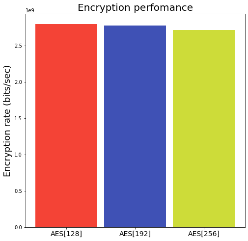
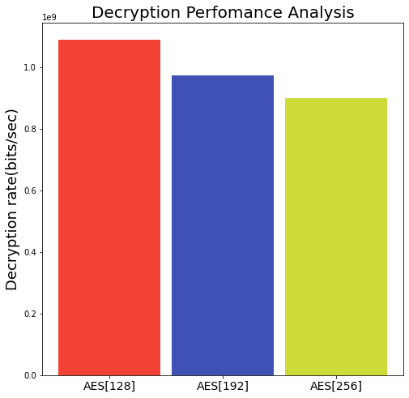
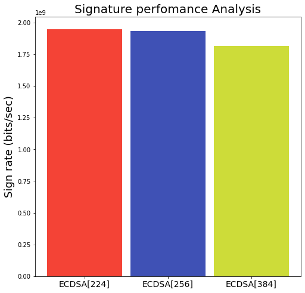
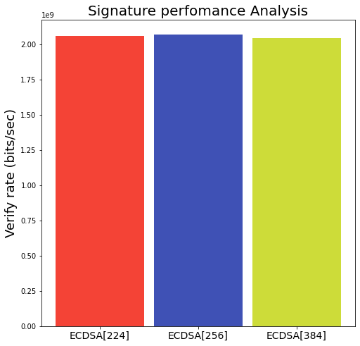
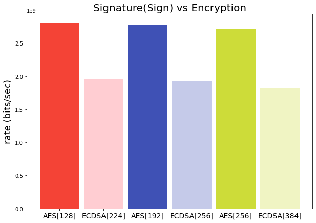
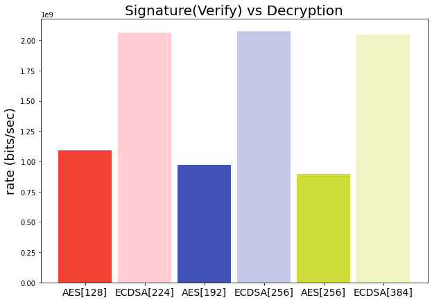

```python
import numpy as np
import pandas as pd
import matplotlib.pyplot as plt
```

# Cargar conjunto de datos
Se obtiene el conjunto de datos y se separa por nivel de seguridad, esto debido a que las pruebas que se realizaron fueron las siguientes:
- Cifrador simetrico AES[128]  / cifrador asimetrico EC[224] / ECDSA con SHA224
- Cifrador simetrico AES[192]  / cifrador asimetrico EC[256] / ECDSA con SHA256
- Cifrador simetrico AES[256]  / cifrador asimetrico EC[384] / ECDSA con SHA512


```python
df      = pd.read_csv("data.csv")
aes128  = df[df['CIPHER_ALGORITHM']==cipher_security[0]]
aes192  = df[df['CIPHER_ALGORITHM']==cipher_security[1]]
aes256  = df[df['CIPHER_ALGORITHM']==cipher_security[2]]
columns =  ['FILE_SIZE','SIGN_TIME','VERIFY_TIME','ENCRYPTION_TIME','DECRYPTION_TIME']
```

### Informacion del conjunto de datos
Se muestra la informacion sobre el conjunto de datos, en donde se observa el tipo de cada columna, cantidad de columnas y tamaño del conjunto de datos


```python
df.info()
```

    <class 'pandas.core.frame.DataFrame'>
    RangeIndex: 3528 entries, 0 to 3527
    Data columns (total 10 columns):
     #   Column              Non-Null Count  Dtype 
    ---  ------              --------------  ----- 
     0   FILENAME            3528 non-null   object
     1   FILE_SIZE           3528 non-null   int64 
     2   DE_ENCRYPTION_TIME  3528 non-null   int64 
     3   ENCRYPTION_TIME     3528 non-null   int64 
     4   SIGN_TIME           3528 non-null   int64 
     5   DE_DECRYPTION_TIME  3528 non-null   int64 
     6   DECRYPTION_TIME     3528 non-null   int64 
     7   VERIFY_TIME         3528 non-null   int64 
     8   DH_ALGORITHM        3528 non-null   object
     9   CIPHER_ALGORITHM    3528 non-null   object
    dtypes: int64(7), object(3)
    memory usage: 275.8+ KB


## Procesamiento del conjunto  de datos
Se lleva a cabo el procesamiento de los datos, para obtener las tazas de cifrado,decifrado, firmado y verificacion en bits sobres segundo. 


```python
_aes128 = aes128[columns]
_aes192 = aes192[columns]
_aes256 = aes256[columns]
def toSec(x):
    return x/1000
def bytesToBits(x):
    return x*8
def getRates(dff):
    r0      = getRate(dff,'FILE_SIZE','ENCRYPTION_TIME',fx=bytesToBits,gx=toSec)
    r1      = getRate(dff,'FILE_SIZE','DECRYPTION_TIME',fx=bytesToBits,gx=toSec)
    r2      = getRate(dff,'FILE_SIZE','SIGN_TIME',fx=bytesToBits,gx=toSec)
    r3      = getRate(dff,'FILE_SIZE','VERIFY_TIME',fx=bytesToBits,gx=toSec)
    return r0,r1,r2,r3
# getRates(_aes128)
info_df = pd.DataFrame(
    {
        'AES[128]':getRates(_aes128),
        'AES[192]':getRates(_aes192),
        'AES[256]':getRates(_aes256),
    },
    index=['Encryption(bytes/ms)','Decryption(bytes/ms)','Sign(bytes/ms)','Verify(bytes/ms)']
)
info_df
```


<div>
<style scoped>
    .dataframe tbody tr th:only-of-type {
        vertical-align: middle;
    }

    .dataframe tbody tr th {
        vertical-align: top;
    }

    .dataframe thead th {
        text-align: right;
    }
</style>
<table border="1" class="dataframe">
  <thead>
    <tr style="text-align: right;">
      <th></th>
      <th>AES[128]</th>
      <th>AES[192]</th>
      <th>AES[256]</th>
    </tr>
  </thead>
  <tbody>
    <tr>
      <th>Encryption(bytes/ms)</th>
      <td>2.799407e+09</td>
      <td>2.773855e+09</td>
      <td>2.716963e+09</td>
    </tr>
    <tr>
      <th>Decryption(bytes/ms)</th>
      <td>1.090801e+09</td>
      <td>9.739476e+08</td>
      <td>8.991133e+08</td>
    </tr>
    <tr>
      <th>Sign(bytes/ms)</th>
      <td>1.949181e+09</td>
      <td>1.930968e+09</td>
      <td>1.816723e+09</td>
    </tr>
    <tr>
      <th>Verify(bytes/ms)</th>
      <td>2.061369e+09</td>
      <td>2.072740e+09</td>
      <td>2.045049e+09</td>
    </tr>
  </tbody>
</table>
</div>


## Grafica(00): Tasa cifrado
En esta grafica se observa la tasa de cifrado tomando en cuenta los 3 niveles de seguridad utilizando AES[128],AES[192] y AES[256]. En el eje x se muestran el algortimo con su respectivo tamaño de llave, en el eje y se encuentra la tasa en $\frac{bits}{secs}$


```python
index= 0 
bars = [
        Bar('#F44336',info_df['AES[128]'][index]), 
        Bar('#3F51B5',info_df['AES[192]'][index]),
        Bar('#CDDC39',info_df['AES[256]'][index])
]
barPlot(
    title="Encryption perfomance",
    axis_labels=['Key size (bit)','Encryption rate (bits/sec)'],
    bars = bars
)
```


    <AxesSubplot:title={'center':'Encryption perfomance'}, ylabel='Encryption rate (bits/sec)'>


    

    


## Grafica(01): Tasa de decifrado
En esta grafica se observa la tasa de decifrado tomando en cuenta los 3 niveles de seguridad utilizando AES[128],AES[192] y AES[256]. En el eje x se muestran el algortimo con su respectivo tamaño de llave, en el eje y se encuentra la tasa en $\frac{bits}{secs}$


```python
index = 1 
bars = [
    Bar('#F44336',info_df['AES[128]'][index]), 
    Bar('#3F51B5',info_df['AES[192]'][index]),
    Bar('#CDDC39',info_df['AES[256]'][index])
]
barPlot(
    title="Decryption Perfomance Analysis",
    axis_labels=['Key size (bits)','Decryption rate(bits/sec)'],
    bars = bars
)
```


    <AxesSubplot:title={'center':'Decryption Perfomance Analysis'}, ylabel='Decryption rate(bits/sec)'>


    

    


## Grafica(02): Tasa de generacion de firma
En esta grafica se observa la tasa de generacion firma tomando en cuenta los 3 niveles de seguridad utilizando ECDSA[224],ECDSA[256] y ECDSA[384]. En el eje x se muestran el algortimo con su respectivo tamaño de llave, en el eje y se encuentra la tasa en $\frac{bits}{secs}$


```python
index = 2
bars = [
    Bar('#F44336',info_df['AES[128]'][index]), 
    Bar('#3F51B5',info_df['AES[192]'][index]),
    Bar('#CDDC39',info_df['AES[256]'][index])
]
barPlot(
    title="Signature perfomance Analysis",
    axis_labels=['Key size (bits)','Sign rate (bits/sec)'],
    bars = bars ,
    xticks= ds_security
)
```


    <AxesSubplot:title={'center':'Signature perfomance Analysis'}, ylabel='Sign rate (bits/sec)'>


    

    


## Grafica(03): Tasa de verificacion de firma
En esta grafica se observa la tasa de verificacion firma tomando en cuenta los 3 niveles de seguridad utilizando ECDSA[224],ECDSA[256] y ECDSA[384]. En el eje x se muestran el algortimo con su respectivo tamaño de llave, en el eje y se encuentra la tasa en $\frac{bits}{secs}$


```python
index = 3
bars = [
    Bar('#F44336',info_df['AES[128]'][index]), 
    Bar('#3F51B5',info_df['AES[192]'][index]),
    Bar('#CDDC39',info_df['AES[256]'][index])
]
barPlot(
    title="Signature perfomance Analysis",
    axis_labels=['Key size (bits)','Verify rate (bits/sec)'],
    bars = bars ,
    xticks= ds_security
)
```


    <AxesSubplot:title={'center':'Signature perfomance Analysis'}, ylabel='Verify rate (bits/sec)'>


    

    


## Grafica(04): Tasa de cifrado vs Tasa de generacion de firma
En la grafica se muestra en el eje x los algortimos de cifrado simetrico y el algortimo de firma: 
- AES[128]  / ECDSA[224]
- AES[192]  / ECDSA[256]
- AES[256]  / ECDSA[384]

En el eje y se tiene la tasa de cifrado y generacion de firma en $\frac{bits}{secs}$


```python
from functools import reduce
bars = [
    Bar('#F44336',info_df['AES[128]'][0]), 
    Bar('#FFCDD2',info_df['AES[128]'][2]), 
    Bar('#3F51B5',info_df['AES[192]'][0]),
    Bar('#C5CAE9',info_df['AES[192]'][2]),
    Bar('#CDDC39',info_df['AES[256]'][0]),
    Bar('#F0F4C3',info_df['AES[256]'][2]),
]
xticks = reduce(lambda x,y : list(x) + list(y),list(zip(cipher_security,ds_security)),[])
# xticks
barPlot(
    title="Signature(Sign) vs Encryption",
    axis_labels=['Key size (bits)','rate (bits/sec)'],
    bars = bars ,
    xticks= xticks,
    figsize=(10,7)
)

```


    <AxesSubplot:title={'center':'Signature(Sign) vs Encryption'}, ylabel='rate (bits/sec)'>


    

    


## Grafica(04): Tasa de decifrado vs Tasa de verificacion de firma
En la grafica se muestra en el eje x los algortimos de cifrado simetrico y el algortimo de firma: 
- AES[128]  / ECDSA[224]
- AES[192]  / ECDSA[256]
- AES[256]  / ECDSA[384]

En el eje y se tiene la tasa de decifrado y verificacion de firma en $\frac{bits}{secs}$


```python
from functools import reduce
bars = [
    Bar('#F44336',info_df['AES[128]'][1]), 
    Bar('#FFCDD2',info_df['AES[128]'][3]), 
    Bar('#3F51B5',info_df['AES[192]'][1]),
    Bar('#C5CAE9',info_df['AES[192]'][3]),
    Bar('#CDDC39',info_df['AES[256]'][1]),
    Bar('#F0F4C3',info_df['AES[256]'][3]),
]
xticks = reduce(lambda x,y : list(x) + list(y),list(zip(cipher_security,ds_security)),[])
# xticks
barPlot(
    title="Signature(Verify) vs Decryption",
    axis_labels=['Key size (bits)','rate (bits/sec)'],
    bars = bars ,
    xticks= xticks,
    figsize=(10,7)
)
```


    <AxesSubplot:title={'center':'Signature(Verify) vs Decryption'}, ylabel='rate (bits/sec)'>


    

    


## Utilerias


```python
class Bar(object):
    def __init__(self,color,data):
        self.color=color
        self.data=data

def getRate(df,col1,col2,**kwargs):
    fx = kwargs.get('fx',lambda x:x)
    gx = kwargs.get('gx',lambda x:x)
    return fx(df[col1].sum())/gx(df[col2].sum())
CIPHER_SECURITY = [128,192,256]
cipher_security = ['AES[128]','AES[192]','AES[256]']
ec_security     = ['EC[224]','EC[256]','EC[384]']
ds_security     = ['ECDSA[224]','ECDSA[256]','ECDSA[384]']

def barPlot(**kwargs):
    figsize     = kwargs.get('figsize',(8,8))
    _,ax        = plt.subplots(figsize =figsize)
    title       = kwargs.get('title','Default title')
    axis_labels = kwargs.get('axis_labels',['X','Y'])
    xticks      = kwargs.get('xticks',cipher_security)
    bars        = kwargs.get('bars',[])
    ax.set_title(title,fontsize=20)
#     ax.set_xlabel(axis_labels[0],fontsize=18)
    ax.set_ylabel(axis_labels[1],fontsize=18)
    ax.set_xticks(range(len(xticks)))
    ax.set_xticklabels(xticks,fontsize=14)
    WIDTH = .9
#     print(bars)
    for i,bar in enumerate(bars):
        ax.bar(i,height = bar.data,width=WIDTH,color=bar.color)
    return ax
```
